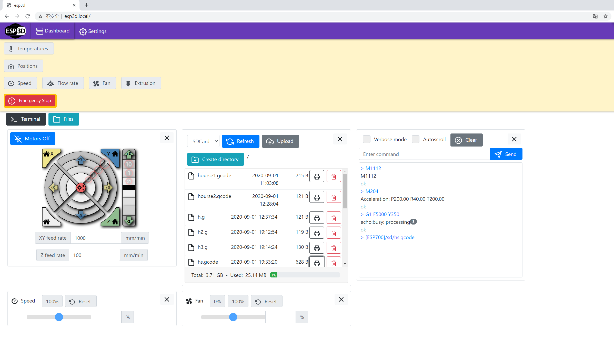
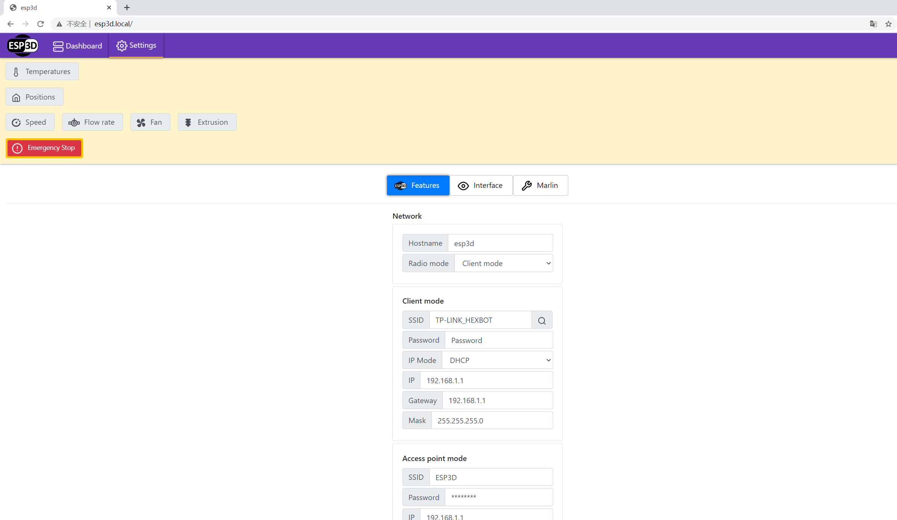
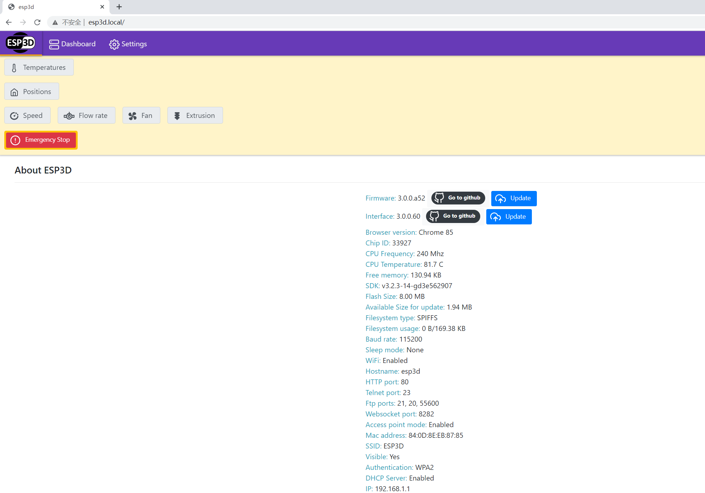
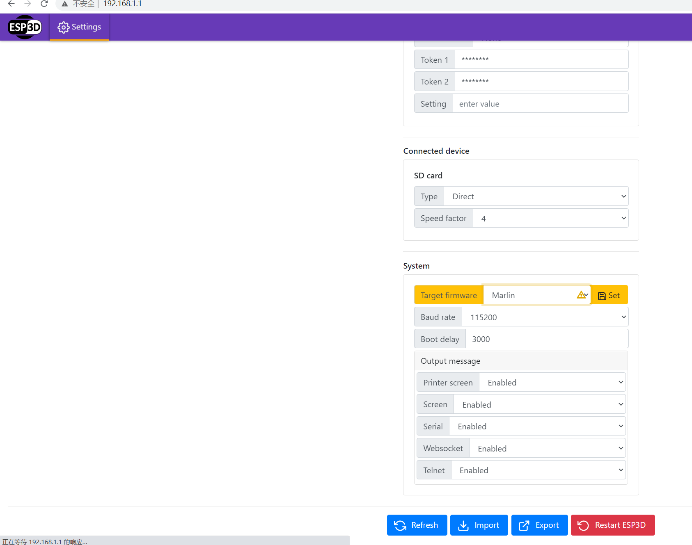

Thanks to ESP3D, Marlin and the entire open source community.

We have just completed a basic test version of ESP3D porting on Rotrics DexArm TouchScreen.
Feel free to test it, if you are interested.

If you have any questions or suggestions, please give us feedback.

## Basic Feature

### Remote Control
- Remote Control Position, Terminal Command，Temperatures, Fan, etc
- Remote update or print SD Files

### NetWork Config
- Config NetWork

### About ESP3D
- About ESP3D
- Update Firmware through WebUI

## Basic Control on TouchScreen
- Basic Control
- Sdcrad File Select & Send(Max number of Files: 5)

# Feature TODO List
Because this is a basic test version, there are many features&functions need to do in the future.
- ESP3D currently only uses a single thread, it does not support multitasking in LVGL and HTTP. Therefore, the LVGL cannot be updated during the execution of Gcode file sending.
- The progress cannot be reported when WEBUI send SDCard files
- Because of the native Flash partition problem, only SD card file system is supported, no ESP Flash file system
- TouchScreen calibration is required for every init start.Cannot start network function before touch screen calibration.
- More and more features need to be developed

# Firmware Update Warning!!!
The native firmware of DexArm TouchScreen supports updating our customized ESP3D firmware via SDCard. After upgrading to ESP3D, the firmware can be updated via WebUI, and it also supports updating back to the native firmware of TouchScreen.
We have tested this update process dozens of times.

However, firmware update has certain risks, please update carefully. An hardware update interface (UART0,IO0,IO2)is reserved inside the TouchScreen. If you are willing to disassemble the TouchScreen, understand the principle of ESP32 program update, and have a USB to serial port tool,like CP2102 or CH340, You can upgrade at will:)

# Firmware Update Method
If you are using the DexArm TouchScreen native firmware, you can follow the previous TouchScreen firmware update method and copy the contents of the compressed package to the SD card for update.
After upgrading to ESP3D, the firmware can be updated via WebUI, and it also supports updating back to the native firmware of TouchScreen.
We have tested this update process dozens of times.

[ESP3D SDcard zip](bin/sdcard_DexArm_ESP3D_V0.1_20200918.zip)

# Instructions
- After the update is complete, please calibrate the screen first.
- After 3 seconds, the touch screen will automatically generate a AP named ESP3D, link to this AP, and enter through the browser `http://esp3d.local/`或`http://192.168.1.1/`，进入ESP32 Web UI
- Setting > Features bottom System select Marlin

- Start the journey
- If necessary, you can also set TouchScreen to Client mode in Setting> Features

# The following is the original README of ESP3D 3.0

# ESP3D 3.0 alpha stage

<H3>Do not use it for production, but feel free to test it and feedback</H3>

Use the webUI 3.0 : https://github.com/luc-github/ESP3D-WEBUI/blob/3.0/dist/printer/index.html.gz

[Latest development version  ](https://github.com/luc-github/ESP3D/tree/3.0)     
please use Arduino ide 1.8.9+ with  or    
or PlatformIO

# TODO List to move to beta
 * [Finish web UI Major features (3D printing and GRBL)]( https://github.com/luc-github/ESP3D-WEBUI/issues/94#issuecomment-660600551)
 * Do user documentation: Readme / features list description / wiki/  Features videos etc...
 * Test current features heavily
 * Collect some feedback

# TODO List in beta
 * Test heavily (still)
 * [Implement minor missing features not present in alpha](https://github.com/luc-github/ESP3D-WEBUI/issues?q=is%3Aissue+is%3Aopen+label%3A3.0)
 * Translate UI and build language packs 
 * Adjust features according feedback
 * TBD
 
